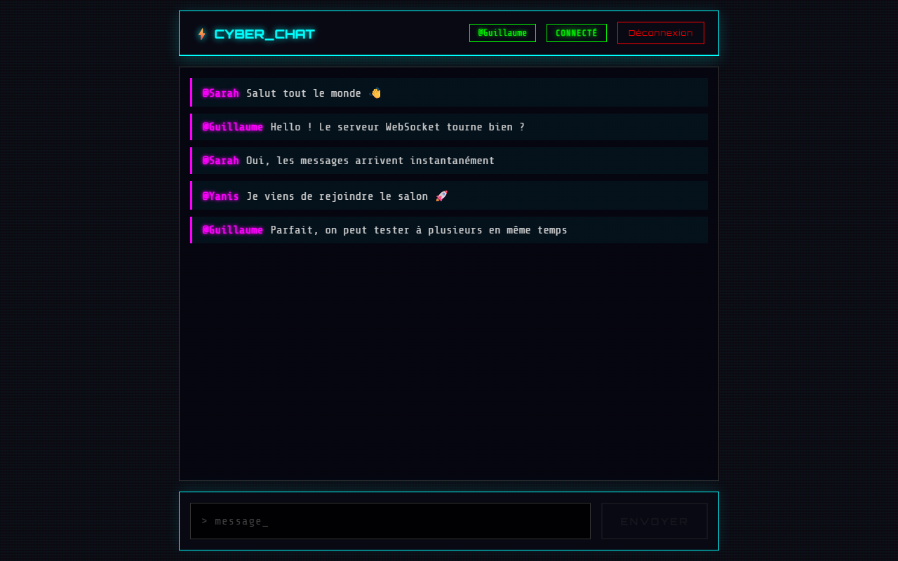

# Cyber Chat

> Salon de discussion en temps réel : un serveur WebSocket Node.js diffuse instantanément chaque message à tous les clients connectés.

**Stack** : React 18 · WebSocket (`ws`) · Node.js
**Contexte** : projet de cours Node.js — EFREI, B2



## Fonctionnalités

- Connexion avec un identifiant, puis accès au salon commun.
- Messages diffusés en temps réel à tous les participants.
- Indicateur d'état de la connexion (connecté, déconnecté, erreur).
- Envoi avec la touche Entrée, défilement automatique vers le dernier message.
- Interface responsive au style « terminal » néon.

## Fonctionnement

```
Navigateur A ─┐                          ┌─► Navigateur A
Navigateur B ─┼─► server.js (ws, :8080) ─┼─► Navigateur B
Navigateur C ─┘     diffusion à tous      └─► Navigateur C
```

- `server.js` (~40 lignes) : parse chaque message JSON reçu (les messages mal formés sont ignorés) et le renvoie à tous les clients ouverts.
- `src/App.jsx` : ouvre la connexion à l'entrée dans le salon, la ferme proprement au démontage du composant, et choisit l'URL du serveur selon l'hôte (local ou tunnel ngrok pour tester à plusieurs).

## Choix techniques

| Choix | Pourquoi |
|---|---|
| WebSocket plutôt que du polling HTTP | Connexion persistante et bidirectionnelle : le serveur pousse les messages sans que le client ait à les redemander. |
| Librairie `ws` | Implémentation WebSocket minimale et standard côté Node, sans surcouche. |

## Lancer en local

```bash
npm install
npm run dev     # serveur WebSocket (:8080) + frontend React (:3000)
```

Ouvrir `http://localhost:3000` dans deux onglets pour échanger des messages.

## Limites et pistes d'amélioration

- Messages non persistés : un nouvel arrivant ne voit pas l'historique (stockage Redis ou base de données).
- Pas d'authentification : deux utilisateurs peuvent prendre le même pseudo.
- Un seul salon : ajouter des salons multiples et un indicateur « en train d'écrire ».
