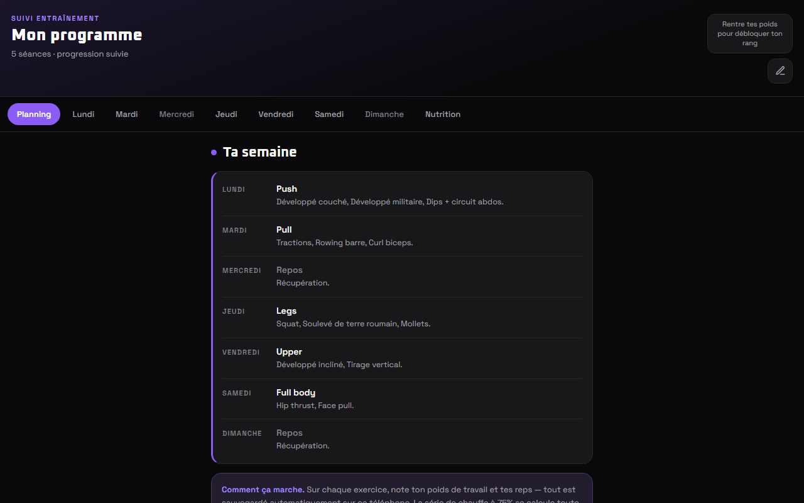
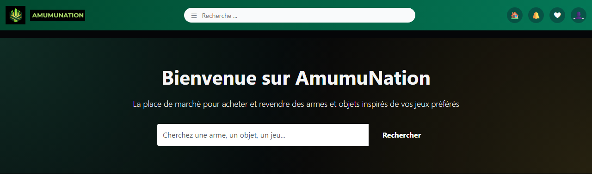

# Guillaume Alessandri

**Développeur web full-stack — étudiant à l'EFREI**

Je conçois des applications web de bout en bout, de la base de données à l'interface, 
avec une attention particulière à la sécurité et à la fiabilité des données.

[Projet principal](#projet-principal--portail-client-b2b) · [Projets](#projets) · [Autres projets](#autres-projets) · [Compétences](#compétences)

---

## Projet principal — Portail client B2B

> Application réelle développée pour une entreprise de distribution alimentaire à l'export.
> Le code est privé (confidentialité client) : cette section en présente l'architecture et les choix techniques.

Portail sécurisé permettant aux clients professionnels de consulter leurs documents comptables, grilles tarifaires et offres ciblées, accompagné d'un back-office complet pour l'équipe interne.

**Stack** : Next.js 15 (App Router) · React 19 · TypeScript · Tailwind CSS · Supabase (PostgreSQL, Auth, Storage, Vault) · Resend · React Email · Zod
**Infrastructure** : monorepo npm workspaces · base hébergée en Union européenne (conformité RGPD)

<table>
<tr>
<td valign="top" width="50%">

### Fonctionnalités

**Espace client**
- Tableau de bord, documents (factures, certificats), grilles tarifaires
- Offres filtrées selon le profil du client (segments, exclusions alimentaires)
- Dépôt de documents vers l'entreprise (commandes, réclamations)
- Gestion de ses appareils de confiance

**Back-office**
- Gestion des clients, avec aperçu « voir comme ce client »
- Publication de documents, tarifs, offres et annonces
- Composition et envoi d'emails, suivi de la file d'envoi
- Gestion des employés et journal d'audit
- Trois rôles : `super_admin`, `employee`, `client`

**Emails transactionnels**
- 7 modèles conçus avec React Email
- File d'attente avec nouvelles tentatives à délai croissant (5 essais)

</td>
<td valign="top" width="50%">

### Sécurité

- **Accès sur invitation uniquement**, définition du mot de passe à la première connexion
- **Row Level Security** sur toutes les tables : chaque client n'accède qu'à ses données
- **Chiffrement des colonnes sensibles** (pgcrypto), clé stockée dans Supabase Vault
- **Validation Zod côté serveur** de toutes les entrées
- **Protection anti-IDOR** : propriété de la ressource vérifiée avant chaque accès
- **Fichiers privés** servis par URLs signées à durée limitée ; vérification du bucket au démarrage
- **Appareils de confiance** limités à 2, empreinte HMAC, limite garantie par verrou SQL (`SELECT FOR UPDATE`)
- **Désactivation immédiate** des comptes, contrôlée à chaque requête
- **Journal d'audit** des actions sensibles, adresses IP chiffrées
- **En-têtes HTTP** : CSP, HSTS, X-Frame-Options
- **Escalade de privilèges bloquée** au niveau des politiques RLS

</td>
</tr>
</table>

---

## Projets

<table>
<tr>
<td width="50%" valign="top">

### [Suivi Muscu](Suivi_Muscu)
Suivi d'entraînement : planning, progression des charges, rang calculé sur le 1RM et objectifs nutritionnels. Un seul fichier, sans dépendance, avec migration automatique des sauvegardes.

`HTML` `CSS` `JavaScript`
</td>
<td width="50%" valign="top">

### [Cyber Chat](Chat_WebSocket)
Salon de discussion en temps réel : un serveur WebSocket diffuse instantanément chaque message à tous les participants.

`React` `WebSocket` `Node.js`
</td>
</tr>
<tr>
<td width="50%" valign="top">

### [Amumunation](Amumunation_Symfony)
Marketplace inspirée de GTA : annonces publiées par les utilisateurs, panier en session, commandes et authentification.

`PHP` `Symfony` `Doctrine` `PostgreSQL`
</td>
<td width="50%" valign="top">

### [Task Manager](Task_Manager_MERN)
Gestion de tâches et de dossiers avec authentification JWT et trois niveaux de droits. Projet de groupe : **développement du frontend React**.

`React` `Node.js` `Express` `MongoDB`
</td>
</tr>
</table>

## Autres projets

| Projet | Description | Stack |
|---|---|---|
| [Smartbike](Challenge_Web-2025) | Site e-commerce de vélos — Challenge Web 2025 | HTML · CSS · JavaScript |
| [Infinity Mage](Infinity_Mage_2025) | Jeu de combat au tour par tour en console | C |
| [Jeu de combat](Jeu_Combat_java) | Jeu de combat en programmation orientée objet | Java |
| [Cassiopeia](HTML_2024-2025) | Page de présentation d'un personnage de League of Legends | HTML · CSS |

---

## Compétences

| Domaine | Technologies |
|---|---|
| **Frontend** | React, Next.js, TypeScript, JavaScript, Tailwind CSS, HTML / CSS |
| **Backend** | Node.js, Express, PHP, Symfony |
| **Bases de données** | PostgreSQL, Supabase, MongoDB, Doctrine ORM |
| **Sécurité** | Row Level Security, JWT, bcrypt, chiffrement pgcrypto, validation Zod, CSP / HSTS |
| **Outils** | Git, Docker, npm workspaces |
| **Autres langages** | Java, C, Python |
