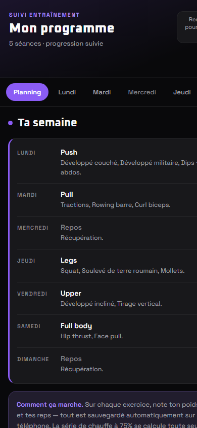

# Suivi Muscu

> Application web de suivi de musculation : planning hebdomadaire, progression des charges, rang calculé sur la force et objectifs nutritionnels — dans un seul fichier, sans dépendance.

**Stack** : HTML · CSS · JavaScript (vanilla) · `localStorage`

  
  &nbsp;
  

## Fonctionnalités

- **Planning éditable** : choix des jours d'entraînement, des exercices et d'un circuit abdos par séance.
- **Suivi des charges** : poids et répétitions enregistrés par exercice ; la série d'échauffement (75 %) est calculée automatiquement.
- **Système de rang** : de Bronze à Grand Champion, à partir du 1RM estimé (charge maximale théorique sur une répétition).
- **Nutrition** : besoin calorique calculé selon la dépense quotidienne et l'objectif (perte, maintien, prise), avec un plancher de sécurité.
- **Thèmes** de couleurs et interface pensée pour le mobile, à utiliser directement à la salle.

## Choix techniques

| Choix | Pourquoi |
|---|---|
| Un seul fichier, aucun framework | S'ouvre partout, se déploie en un clic, aucune dépendance à maintenir. |
| `localStorage` | Données privées, conservées sur l'appareil, sans serveur ni compte. |
| Validation et migration du state au chargement | Une ancienne sauvegarde est mise à niveau automatiquement ; une sauvegarde corrompue est copiée avant d'être remplacée — l'utilisateur ne perd jamais son historique. |

## Lancer

Ouvrir `index.html` dans un navigateur. Aucune installation.

## Limites et pistes d'amélioration

- Données liées au navigateur : un export / import JSON permettrait de les sauvegarder ou de changer d'appareil.
- Une version PWA (manifest + service worker) rendrait l'application installable et utilisable hors ligne.
- Les calculs (1RM, calories, rang) mériteraient des tests unitaires.
